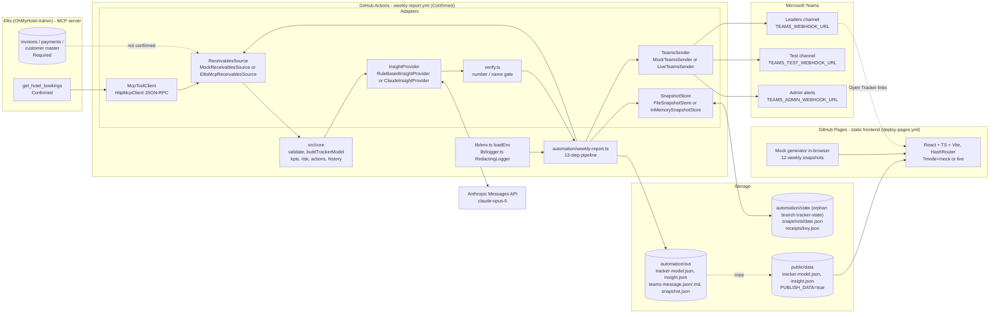

# Architecture — Outstanding Receivables Tracker

**Purpose.** This document describes the components of the prototype (static frontend, automation pipeline, adapters, storage), how data flows from Ellis to the weekly Teams report and the tracker UI, where state lives, how the scheduled job behaves (`DRY_RUN`, idempotency, retries, alerts), which environment variables control it, and the deployment options in priority order. Component behaviour is derived from `automation/weekly-report.ts`, `automation/lib/*.ts`, `src/adapters/**` and the build/test configuration files.

**Status:** Draft v0.1 — 2026-09-07

> **요약 (Korean summary).** 시스템은 (1) GitHub Pages에 배포되는 정적 React 프런트엔드, (2) 매주 토요일 09:00(호치민 시간, UTC 02:00)에 GitHub Actions에서 실행되는 13단계 자동화 파이프라인, (3) 교체 가능한 어댑터(데이터 소스 mock/Ellis, 인사이트 rule-based/Claude, Teams 전송 mock/live, 스냅샷 저장소 file/in-memory)로 구성됩니다. 정적 사이트는 Ellis MCP나 Teams Webhook을 직접 호출할 수 없으므로(비밀키 노출·CORS·스케줄 부재) 서버 측 실행 환경이 필요하며, 1순위는 GitHub Actions입니다. 실데이터 잔액을 공개 Pages 사이트에 게시하면 안 되며 비공개 저장소 + 접근제한 또는 보호된 데이터 엔드포인트를 사용해야 합니다.

### Status legend

| Status | Meaning |
| --- | --- |
| **Confirmed** | Present in the repository and read for this document |
| **Specified** | Implemented in the repository but not yet exercised against the live system (no run on GitHub, no Teams webhook, no Ellis endpoint) |
| **Required** | Missing dependency / decision |

---

## 1. Component diagram



---

## 2. Frontend (GitHub Pages, static)

| Aspect | Detail | Status |
| --- | --- | --- |
| Stack | React 18, TypeScript 5.7, Vite 6, React Router 6 (`HashRouter`), Recharts 2, Zod 4 | Confirmed (`package.json`) |
| Build | `npm run build` = `tsc --noEmit` + `vite build` → `dist/`, `target es2020`, no sourcemaps; `base = VITE_BASE_PATH ?? '/'` (set to `/<repo>/` for project Pages) | Confirmed (`vite.config.ts`) |
| Aliases | `@core` → `src/core`, `@adapters` → `src/adapters`, `@app` → `src/app` | Confirmed |
| Routes | `#/`, `#/aging`, `#/customers`, `#/customers/:id`, `#/invoices`, `#/actions`, `#/insights`; unknown routes redirect to `#/` | Confirmed (`src/app/App.tsx`) |
| Mode toggle | Resolution order (`src/app/data/mode.ts`): `?mode=mock` / `?mode=live` in the URL (persisted) → `localStorage` key `ot.mode` → build-time `VITE_DATA_MODE` (default `mock`). Mock: dataset generated in the browser by `MockReceivablesSource` (seed `20260905`), 12 Saturday snapshots via `buildSnapshotHistory`, insight from the rule-based provider (`data/mock-model.ts`). Live: fetches `tracker-model.json` + `insight.json` from `VITE_LIVE_DATA_URL` or `<BASE_URL>data/` with `cache: 'no-store'`; a missing file yields the error "Live data not published yet. Run the weekly pipeline with PUBLISH_DATA=true or switch to mock mode". QA helpers `?simulate=error`, `?simulate=empty`, `?simulate=slow` | Confirmed |
| Calculation | Same `buildTrackerModel()` engine as the pipeline (shared `src/core`) — the UI recomputes any of the 12 reference dates in mock mode; in live mode the reference-date selector is disabled and the published week is shown | Confirmed |
| Persistence | Action Board status in `localStorage` (`ot.actions.<action id>`) and data mode (`ot.mode`) only — prototype | Confirmed |
| Tests | `vitest.workspace.ts` projects `unit` (jsdom, `tests/unit/**`, about 65 tests incl. React component tests) and `integration` (node, `tests/integration/**`, adapters + pipeline, about 15 tests); Playwright `tests/e2e/*.spec.ts` (overview, customers, invoices, actions, states, mobile) on desktop + Pixel 5 against `vite preview` at `127.0.0.1:4173` | Confirmed |

**Why GitHub Pages alone cannot call MCP or Teams:** a static site runs in the visitor's browser. Calling the Ellis MCP endpoint or a Teams webhook from there would (a) expose `ELLIS_MCP_AUTH` and webhook URLs to every visitor (anyone with the webhook URL can post to the channel), (b) be blocked by CORS on the MCP server, and (c) provide no scheduler — nothing runs on Saturday 09:00 unless someone opens the page. Server-side execution is therefore mandatory for the weekly job; the frontend only **reads** published, pre-aggregated JSON.

---

## 3. Automation layer

### 3.1 Scheduled workflow `.github/workflows/weekly-report.yml` — Confirmed (not yet run on GitHub)

| Item | Value |
| --- | --- |
| Trigger 1 | `schedule: cron '0 2 * * 6'` — 02:00 UTC Saturday = **09:00 Asia/Ho_Chi_Minh** (UTC+7, no DST) |
| Trigger 2 | `workflow_dispatch` inputs: `report_date` (blank = latest Saturday), `target_channel` (`test` default / `leaders`), `dry_run` (`true` default / `false`), `data_source` (`mock` default / `ellis`), `ai_provider` (`mock` default / `claude`), `force_resend` (`false` default / `true`) |
| Scheduled-run parameters | Repository **variables** with safe defaults: `DRY_RUN` (`true`), `TARGET_CHANNEL` (`test`), `DATA_SOURCE` (`mock`), `AI_PROVIDER` (`mock`), `TEAMS_SENDER` (`live`), `PUBLISH_DATA` (`false`), plus `REPORT_TIMEZONE`, `REPORTING_CURRENCY`, `TRACKER_BASE_URL` (default `https://<owner>.github.io/<repo>/`), `RECIPIENT_CONFIG` |
| Permissions / concurrency | `permissions: contents: write` (needed to push state and published data); `concurrency: weekly-report`, no cancel-in-progress; `timeout-minutes: 30`; runner `ubuntu-latest`, Node 22 |
| Steps | checkout (`fetch-depth: 0`) → `npm ci` → **restore state** from orphan branch `tracker-state` into `automation/state/` → resolve parameters → **attempt 1** `npx tsx automation/weekly-report.ts` (log to `automation/out/run-1.log`, `continue-on-error`) → **retry after `sleep 120`** if attempt 1 failed (`run-2.log`) → upload `automation/out/*.json`, `*.md`, `*.log` as artifact `weekly-report-<run_id>` (retention 30 days) → **persist state**: commit `automation/state` and force-push to `tracker-state` → optional **publish**: when `vars.PUBLISH_DATA == 'true'` and `public/data/tracker-model.json` exists, commit `public/data/*.json` to the current branch → fail the job only if both attempts failed |
| Retry | exactly one workflow-level retry (2 min later) on top of the pipeline's internal fetch retry (2 attempts, 3 s) |
| Alert | the pipeline posts the admin alert / failure card itself (when not `DRY_RUN`); the workflow surfaces `::error::` and job status |
| Secrets | `ELLIS_MCP_ENDPOINT`, `ELLIS_MCP_AUTH`, `TEAMS_WEBHOOK_URL`, `TEAMS_TEST_WEBHOOK_URL`, `TEAMS_ADMIN_WEBHOOK_URL`, `AI_API_KEY` passed only to the two run steps |

Note: `TEAMS_SENDER` defaults to `live` in the workflow, but `DRY_RUN` defaults to `true`, so nothing is posted until the `DRY_RUN` repository variable is explicitly set to `false`.

### 3.1b Pages deployment `.github/workflows/deploy-pages.yml` — Confirmed

Runs on push to `main` (ignoring `automation/state/**` and `docs/**`) and on `workflow_dispatch`: `npm ci` → `npm run typecheck` + `npm run test` → `npm run build` with `VITE_BASE_PATH` (default `/<repo>/`), `VITE_DATA_MODE` (default `mock`) and `VITE_LIVE_DATA_URL` from repository variables → **bundle guard** (a `grep` over `dist/` for `sk-ant-`, `webhook.office.com`, `logic.azure.com`, `ELLIS_MCP_AUTH=` fails the build) → `configure-pages` / `upload-pages-artifact` / `deploy-pages` (permissions `pages: write`, `id-token: write`).

### 3.2 The 13-step pipeline (`runPipeline` in `automation/weekly-report.ts`) — Confirmed

| Step | Log tag | What happens | Failure behaviour |
| --- | --- | --- | --- |
| 1 | `[1/13]` | Resolve `report_date` = `REPORT_DATE` or `latestSaturday(today in REPORT_TIMEZONE)`; channel = `TARGET_CHANNEL`; log redacted config (`describe(env)`) | `loadEnv()` throws on invalid config → `FATAL`, exit 1 |
| 2 | `[2/13]` | Idempotency: key `weekly-outstanding:<date>:<channel>`; if a receipt exists with `ok && !dry_run` and this run is not `DRY_RUN` and `FORCE_RESEND` is not `true` → `skipped-duplicate`, exit 0 | — |
| 3 | `[3/13]` | `source.fetchDataset(report_date)` wrapped in `withRetry(2 attempts, 3 000 ms)` | → `fail("Data refresh failed: …")` |
| 4 | `[4/13]` | `validateDataset()`; any `error` → fail | → `fail("Data validation failed: …")` |
| 5 | `[5/13]` | `store.getPreviousSnapshot(date)`; mock source with empty store seeds 11 historical snapshots | — |
| 6 | `[6/13]` | `buildTrackerModel()` — dedupe issues, FX conversion, outstanding, aging, WoW, FX effect | — |
| 7 | `[7/13]` | Risk Score (inside `buildTrackerModel`); logs counts of Critical/High | — |
| 8 | `[8/13]` | `generateInsight()` — provider (rule-based or Claude) with automatic rule-based fallback | never throws (fallback) |
| 9 | `[9/13]` | Verification report logged (`ok`, numbers checked, unverified, notes) | — |
| 10 | `[10/13]` | `buildTeamsMessage()` → Adaptive Card + Markdown (length logged) | — |
| 12a | — | Write `automation/out/{tracker-model.json (publicModel), insight.json, teams-message.json, teams-message.md, snapshot.json}` and `store.saveSnapshot()` **before** sending so a send failure still leaves evidence | — |
| 11 | `[11/13]` | `DRY_RUN` → write dry-run receipt, status `dry-run`, exit 0. Else `sender.send(message, channel)`; save receipt; on failure → admin alert, status `failed`, exit 1 | — |
| 12 | `[12/13]` | Snapshot + receipt saved (logged) | — |
| 13 | `[13/13]` | Failure path (`fail()`): write failure card to `teams-message.json`; if not `DRY_RUN` send **"Data refresh failed"** card to the target channel; always `sender.alert(...)`; save `<key>:failure` receipt; status `failed`, exit 1 | — |

Post-run (main only): if `PUBLISH_DATA=true` and a model exists, copy `tracker-model.json` and `insight.json` to `public/data/`.

Exit codes: `0` for `sent` / `dry-run` / `skipped-duplicate`; `1` for `failed` or fatal config error.

### 3.3 `DRY_RUN` semantics — Confirmed

- Default **`true`** (`bool(env.DRY_RUN, true)`); only `false|0|no|off` disables it.
- In dry run: data is fetched, validated, calculated, insight generated, message built and **written to `automation/out/`**; the snapshot **is saved**; a receipt with `dry_run: true, attempts: 0` is saved; **nothing is posted** to Teams; the failure path also skips the channel message but still calls `sender.alert()` (mock sender in the dry-run npm script).
- A dry-run receipt does **not** block a later real send (idempotency only honours `ok && !dry_run` receipts).
- `npm run report:weekly:dry` = `DRY_RUN=true DATA_SOURCE=mock AI_PROVIDER=mock TEAMS_SENDER=mock`.

### 3.4 Adapters (ports and implementations) — Confirmed

| Port | Implementations | Selection |
| --- | --- | --- |
| `ReceivablesSource` (`fetchDataset`, `healthCheck`) | `MockReceivablesSource` (deterministic, cached per reference date, `history()` / `previousSnapshot()`), `EllisMcpReceivablesSource` (bookings-derived, per-country pagination, PII strip) | `DATA_SOURCE=mock|ellis` |
| `McpToolClient` (`listTools`, `callTool`) | `HttpMcpClient` (Streamable HTTP JSON-RPC, 30 s timeout, `mcp-session-id`); test doubles | injected into the live source |
| `InsightProvider` (`generate`) | `RuleBasedInsightProvider` (templated, always verifiable), `ClaudeInsightProvider` (`claude-opus-5`, structured output) | `AI_PROVIDER=mock|claude`; service always falls back to rule-based |
| `TeamsSender` (`send`, `alert`) | `MockTeamsSender` (records in memory, can simulate 503s), `LiveTeamsSender` (Workflows webhook, 3 attempts, exponential backoff) | `TEAMS_SENDER=mock|live` |
| `SnapshotStore` (`getSnapshot`, `getPreviousSnapshot`, `saveSnapshot`, `listSnapshotDates`, `getReceipt`, `saveReceipt`) | `FileSnapshotStore` (default, `DATA_STORAGE_CONFIG.dir`), `InMemorySnapshotStore` (tests) | pipeline uses file store |

### 3.5 Data flow (weekly run)

```mermaid
sequenceDiagram
  participant GH as GitHub Actions
  participant P as weekly-report.ts
  participant E as Ellis MCP
  participant S as SnapshotStore (file)
  participant C as src/core
  participant AI as InsightProvider
  participant T as Teams webhook
  GH->>P: cron Sat 02:00 UTC (env + secrets)
  P->>S: getReceipt(weekly-outstanding:date:channel)
  P->>E: tools/call get_hotel_bookings ×(countries × pages)
  E-->>P: list[], totalCount (guestName dropped)
  P->>C: validateDataset → buildTrackerModel(prev snapshot)
  P->>AI: generate(InsightInput) → verify → sanitize → fallback
  P->>P: buildTeamsMessage (card + markdown)
  P->>S: saveSnapshot(date) + write automation/out/*
  alt DRY_RUN
    P->>S: saveReceipt(dry_run=true)
  else live
    P->>T: POST Adaptive Card (retry ≤3)
    P->>S: saveReceipt(ok/failed)
    P-->>T: alert on failure
  end
  P->>GH: exit 0/1; optional PUBLISH_DATA → public/data
```

---

## 4. Storage

| Location | Content | Lifetime / VCS |
| --- | --- | --- |
| `automation/state/snapshots/<YYYY-MM-DD>.json` | `Snapshot` (aggregates, per-customer rows, `invoice_state`, FX table) — no PII, no notes | persisted by the workflow on the orphan branch **`tracker-state`** (restored before, force-pushed after each run); `*.json` git-ignored on `main` (`.gitkeep` kept) |
| `automation/state/receipts/<key>.json` | `SendReceipt` `{ idempotency_key, report_date, channel, ok, status, attempts, sent_at, dry_run, error }`; key sanitised to `[A-Za-z0-9_.-]` (e.g. `weekly-outstanding_2026-09-05_leaders`) | same as above |
| `automation/out/` | run artefacts: `tracker-model.json` (public model), `insight.json`, `teams-message.json` (card), `teams-message.md`, `snapshot.json`, `run-1.log` / `run-2.log` | git-ignored; uploaded as workflow artifact (30-day retention) |
| `public/data/tracker-model.json`, `public/data/insight.json` | Frontend live data, written only when `PUBLISH_DATA=true`; the workflow then **commits them to the branch**, which triggers the Pages deployment | **not** git-ignored → becomes part of the deployed site (see §7) |
| `samples/*.sample.json|md` | committed illustrative artefacts from mock data (`npm run report:sample`) | committed |

Idempotency key format: `weekly-outstanding:<report_date>:<channel>`; failure receipts use `…:failure`; admin alerts use `alert:<ISO timestamp>` (not deduplicated).

---

## 5. Environment variables (`automation/lib/env.ts`) — Confirmed

| Variable | Values / default | Notes |
| --- | --- | --- |
| `DATA_SOURCE` | `mock` (default) \| `ellis` | `ellis` requires `ELLIS_MCP_ENDPOINT` |
| `AI_PROVIDER` | `mock` (default) \| `claude` | `claude` requires `AI_API_KEY` |
| `TEAMS_SENDER` | `mock` (default) \| `live` | |
| `DRY_RUN` | default **`true`**; `false|0|no|off` disables | |
| `TARGET_CHANNEL` | `test` (default) \| `leaders` | live + `leaders` + not dry → requires `TEAMS_WEBHOOK_URL`; live + `test` + not dry → requires `TEAMS_TEST_WEBHOOK_URL` |
| `REPORT_DATE` | `YYYY-MM-DD` or empty (auto: latest Saturday) | |
| `REPORTING_CURRENCY` | ISO 4217, default `JPY` (company default currency; changed from USD on 2026-09-07) | |
| `REPORT_LANGUAGE` | `ko` (default) or `en` — wording of engine text and the Teams report | |
| `REPORT_TIMEZONE` | IANA, default `Asia/Ho_Chi_Minh` | |
| `TRACKER_BASE_URL` | default `http://localhost:4173/` (trailing slash enforced) | used for card links |
| `DATA_STORAGE_CONFIG` | JSON, default `{"dir":"automation/state"}` | |
| `RECIPIENT_CONFIG` | JSON, default `{ leaders_channel: "Leadership - Receivables", test_channel: "Outstanding Tracker - Test", admin_channel: null, roles: ["CEO","Finance Leader","GSM Leader","Sales Leaders","Collection Leader"] }` | descriptive only — routing is done by webhook URL |
| **Secrets** `ELLIS_MCP_ENDPOINT`, `ELLIS_MCP_AUTH`, `TEAMS_WEBHOOK_URL`, `TEAMS_TEST_WEBHOOK_URL`, `TEAMS_ADMIN_WEBHOOK_URL`, `AI_API_KEY` (fallback `ANTHROPIC_API_KEY`) | strings or unset | registered with `RedactingLogger.protect()`; `describe()` prints only `set`/`missing` |
| `FORCE_RESEND` | `true` to bypass the idempotency receipt | read directly from `process.env` in `buildDeps()` |
| `PUBLISH_DATA` | `true` to copy model + insight into `public/data/` | read directly in the main block |
| `VITE_BASE_PATH` | build-time base path for Pages | `vite.config.ts` |
| `VITE_DATA_MODE` | build-time default data mode `mock` / `live` (frontend) | `src/app/data/mode.ts` |
| `VITE_LIVE_DATA_URL` | optional protected base URL serving `tracker-model.json` + `insight.json`; default `<BASE_URL>data/` | `src/app/data/mode.ts` |

`.env.example` (Confirmed) documents every variable with placeholders, marks the six `[SECRET]` values, and notes that dotenv is not auto-loaded (export the variables or use `npx dotenv -e .env -- npm run report:weekly`).

---

## 6. Deployment options (priority order)

| Priority | Option | Fits | Caveats |
| --- | --- | --- | --- |
| **1** | **GitHub Actions** (scheduler + runner) + **GitHub Pages** (UI) — **implemented** (`weekly-report.yml`, `deploy-pages.yml`) | Pushes already work from this machine for `bstars00-rgb`; no extra infrastructure; secrets in GitHub Secrets; `FileSnapshotStore` persisted on the `tracker-state` orphan branch | `gh` CLI not installed (use web UI for secrets); runner IP is not fixed (MCP endpoint must be reachable from GitHub runners); cron may start a few minutes late |
| **2** | **Cloudflare Workers (cron trigger) + Supabase/KV** for snapshots, UI on Pages | Fixed-ish egress, sub-minute cron, server-side data endpoint for `VITE_LIVE_DATA_URL` with auth | Requires re-implementing `SnapshotStore` (KV/Postgres) and possibly `fetch`-only MCP client; new vendor accounts |
| **3** | **On-prem / company VM** (Windows Task Scheduler or cron running `npm run report:weekly`) | Ellis endpoint reachable only from the corporate network | Manual patching, secret storage on a host, no built-in audit trail; `FileSnapshotStore` works as-is |

Decision criteria: (a) can the Ellis MCP endpoint be reached from the runner? (R10 in `ELLIS_MCP_MAPPING.md`), (b) confidentiality of the published model (below), (c) who operates it.

---

## 7. Live data for the frontend and confidentiality

- The pipeline writes `automation/out/tracker-model.json` using `publicModel()` (activity notes → `[redacted in published data]`, `payment_reference → null`) and `insight.json`. With `PUBLISH_DATA=true` they are copied to `public/data/`, committed by the workflow and shipped inside the static build, so `?mode=live` (or `VITE_DATA_MODE=live`) can render them without a backend.
- **Caveat:** the public model still contains **customer names, per-invoice balances, owner names and risk grades**. Publishing it on a public GitHub Pages site would disclose customer receivables to anyone with the URL.
- **Required before live publishing:** use a **private repository with GitHub Pages restricted to organisation members** (Enterprise feature) **or** serve the JSON from a **protected endpoint** (`VITE_LIVE_DATA_URL` behind SSO/basic auth, e.g. option 2) and keep only mock data on the public site. Until then run with `PUBLISH_DATA` unset.
- Snapshots (`automation/state`) contain per-customer aggregates and invoice ids/amounts; keep them in a private data branch, never in the public site.

---

## 8. Build, test and quality gates — Confirmed

| Command | Purpose |
| --- | --- |
| `npm run typecheck` | `tsc` for app (`tsconfig.json`) and node tooling (`tsconfig.node.json`) |
| `npm run test` | vitest projects `unit` + `integration` (`vitest.workspace.ts`; about 80 tests, no network) |
| `npm run test:e2e` | Playwright (desktop + mobile Chromium) |
| `npm run test:all` | typecheck → unit/integration → build → e2e |
| `npm run mock:generate` | profile of the mock dataset and scenario coverage |
| `npm run report:sample` | regenerate `samples/` from mock data |
| `npm run report:weekly:dry` | full pipeline, all mock, no send |
